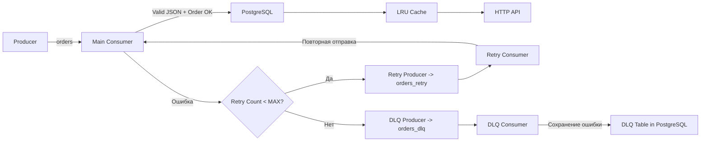

## Микросервис для обработки заказов с использованием Apache Kafka, PostgreSQL, LRU-кэша, Retry-механизма, DLQ и Prometheus-метрик.

Проект демонстрирует полноценный production-pipeline обработки сообщений:

* надёжное потребление Kafka
* повторная обработка (Retry)
* сохранение проблемных сообщений (DLQ)
* кэширование данных
* экспонирование метрик Prometheus
* подготовка к контейнеризации (Docker Compose)

---
 

# Основные возможности

* Приём заказов через Kafka (топик `orders`)
* Основной консьюмер с валидацией и записью в PostgreSQL
* Автоматический прогрев кэша при старте
* LRU-кэш с ограничением памяти
* Retry-механизм через отдельный Kafka-топик (`orders_retry`)
* Dead Letter Queue (`orders_dlq`)
* Прозрачная передача ошибок через Kafka headers
* Prometheus-метрики `/metrics`
* Готовая docker-инфраструктура для Kafka/ZooKeeper/PostgreSQL/сервиса

---

# Архитектура микросервиса



---

# Компоненты

## 1. Producer

Отправляет заказы в Kafka:

* сериализация JSON
* задержка отправки (`PRODUCER_DELAY`)
* корректное формирование ключа

Используется для тестирования и нагрузочной генерации.

---

## 2. Main Consumer (`orders`)

Основной потребитель сообщений.

Функции:

* чтение из Kafka через kafka-go
* `json.Unmarshal`
* `domain.Order.Validate()`
* запись в БД через `OrdService.InsertOrd`
* обновление кэша
* измерение времени обработки
* отправка ошибок:

  * в Retry (если можно исправить)
  * в DLQ (если данные сломаны)

Метрики:

* `orders_processed_total`
* `orders_errors_total`
* `orders_retry_total`
* `orders_dlq_total`
* `order_processing_seconds`

---

## 3. Retry Consumer (`orders_retry`)

Отвечает за повторную обработку.

* поднимает `retry` header на `+1`
* проверяет лимит попыток (`RETRY_MAX`)
* возвращает сообщение обратно в основной топик
* при превышении лимита → отправляет в DLQ

Хедер выглядит так:

```
Key:   "retry"
Value: "0".."N"
```

---

## 4. Dead Letter Queue Consumer (`orders_dlq`)

Все сообщения, которые не удалось восстановить:

* сохраняются в таблицу `dlq` в PostgreSQL
* дополнительно логируются
* хранят причины ошибок (`error_type`, `error_message`, `created_at`)

Это даёт прозрачный аудит всех упавших событий.

---

## 5. LRU-кэш

Ограничивается параметром `CACHE_MB`.

На каждый успешный заказ:

* JSON сериализуется
* помещается в кэш по ключу `order_uid`

При старте сервис вызывает WarmUpCache:

* выбирает все заказы из БД
* кладёт в кэш
* ускоряет первые запросы

---

## 6. PostgreSQL

5 таблиц:

### orders
### delivery
### payment
### items

Хранят валидные заказы.

### dlq

Хранит повреждённые сообщения:

| Поле          | Тип       | Описание          |
| ------------- | --------- | ----------------- |
| id            | bigserial | PK                |
| topic         | varchar   | исходный топик    |
| key           | bytea     | Kafka message key |
| value         | bytea     | тело сообщения    |
| error_type    | varchar   | тип ошибки        |
| error_message | text      | описание ошибки   |
| created_at    | timestamp | время ошибки      |

---

# Метрики Prometheus

Метрики доступны по адресу:

```
GET /metrics
```

Пользовательские метрики:

| Метрика                  | Тип       | Значение               |
| ------------------------ | --------- | ---------------------- |
| orders_processed_total   | Counter   | успешно обработано     |
| orders_errors_total      | Counter   | любые ошибки           |
| orders_retry_total       | Counter   | отправлено в retry     |
| orders_dlq_total         | Counter   | отправлено в DLQ       |
| order_processing_seconds | Histogram | время обработки заказа |

Также экспортируются системные метрики Go-runtime:

* GC
* goroutines
* memory stats
* CPU
* open fd
* network IO


---

# Структура проекта

```
L0/
├── cmd/
│   ├── app/        — основной сервис
│   └── producer/   — генератор заказов
│
├── internal/
│   ├── config/      — загрузка ENV
│   ├── domain/      — структура Order + Validate
│   ├── infrastructure/
│   │   ├── cache/   — LRU-кэш
│   │   ├── db/      — PostgreSQL репозиторий
│   │   ├── http/    — HTTP-ручки
│   │   └── kafka/   — consumers + producers
│   ├── metrics/     — Prometheus registry
│   └── usecase/     — бизнес-логика
│
└── docker-compose.yml
```

---

# Docker-инфраструктура

Проект включает docker-compose для развёртывания:

* Kafka
* ZooKeeper
* PostgreSQL
* Kafka UI
* Order Processing Service

Старт:

```
docker-compose up -d
```

Проверка сервисов:

| Сервис             | URL                                                            |
| ------------------ | -------------------------------------------------------------- |
| Prometheus metrics | [http://localhost:8080/metrics](http://localhost:8080/metrics) |
| Order UI           | [http://localhost:8080](http://localhost:8080)                 |
| Kafka UI           | [http://localhost:8081](http://localhost:8081)                 |
| PostgreSQL         | localhost:5432                                                 |

---

# Запуск локально (без Docker)

Основной сервис:

```
go run ./cmd/app
```

Producer:

```
go run ./cmd/producer
```

---

# Тестирование

Запуск тестов:

```
go test ./... -v
```

---


Проект реализует полный жизненный цикл обработки заказов:

* Kafka → обработка → Retry → DLQ → БД → Кэш → HTTP
* стабильная, расширяемая архитектура
* прозрачная диагностика
* метрики, ретраи, обработка ошибок
